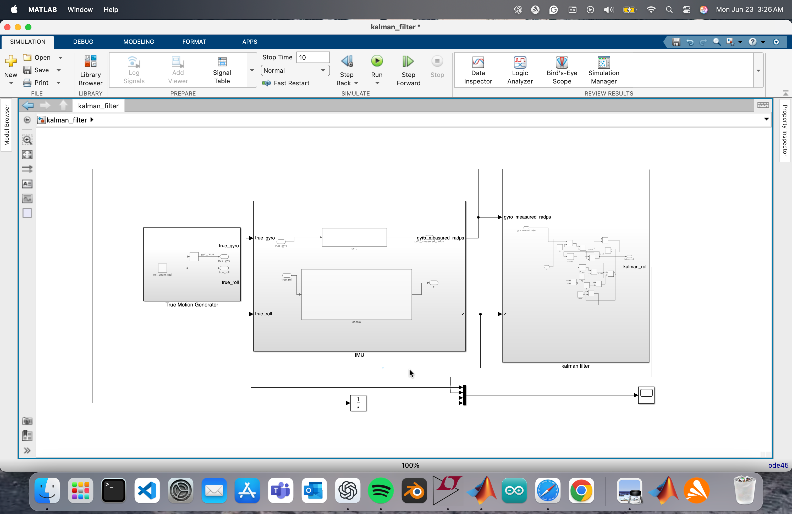
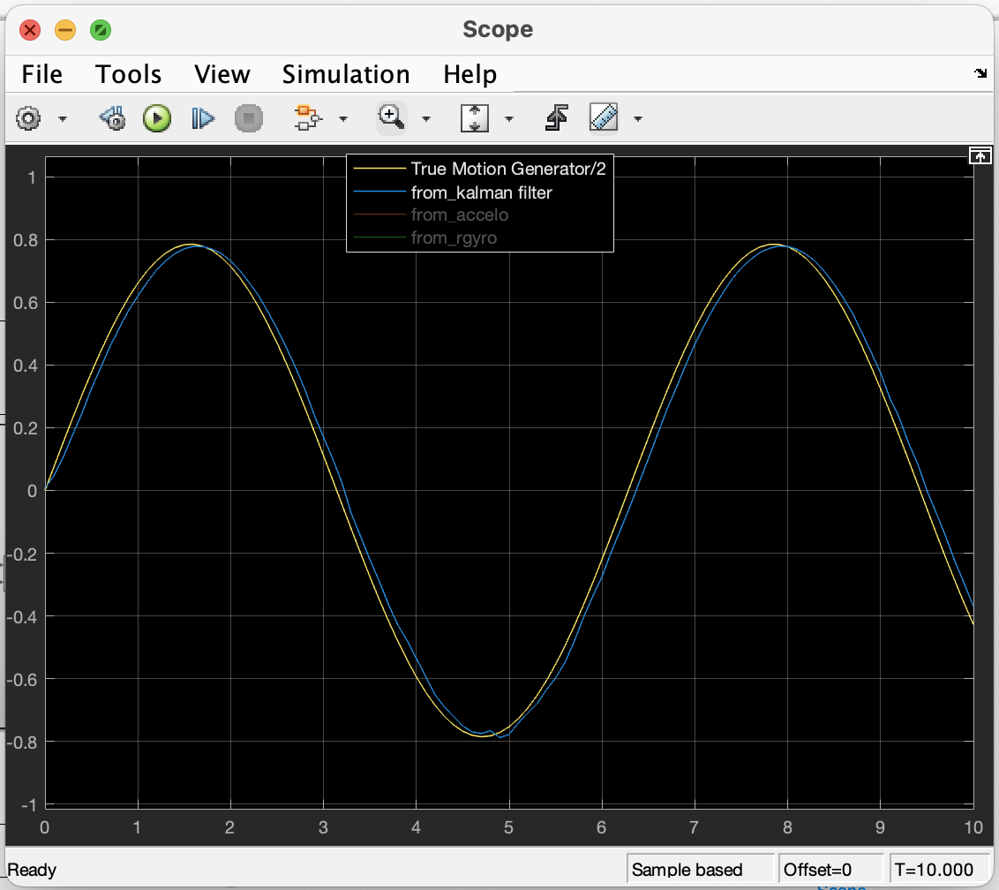
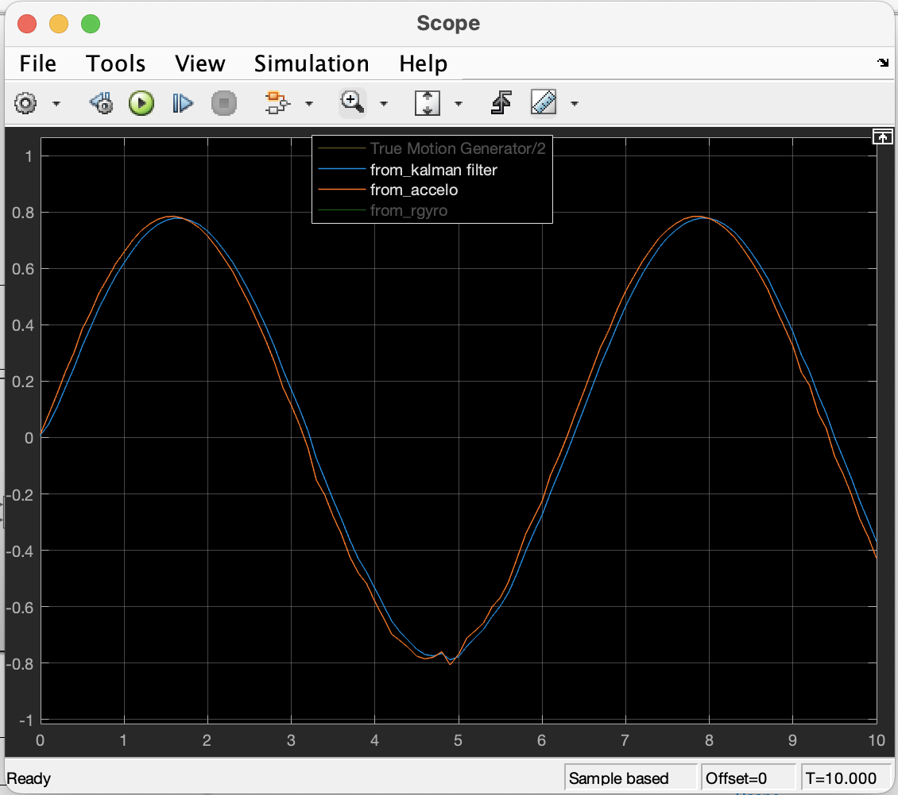
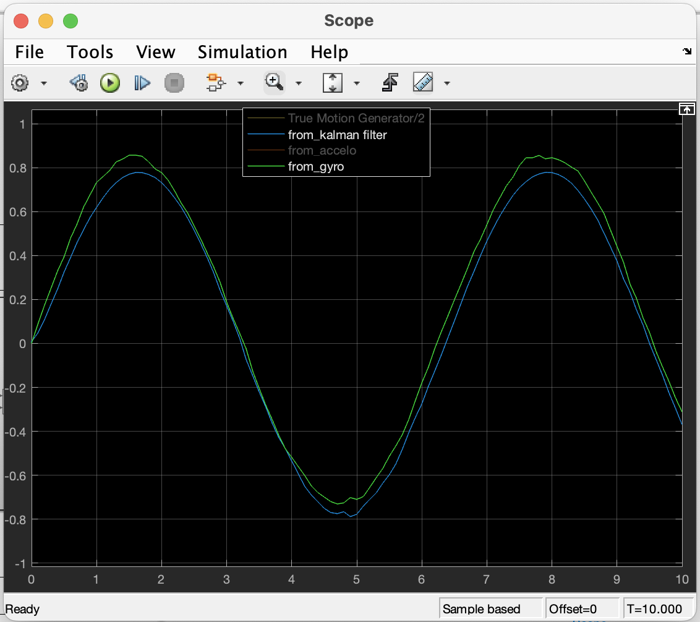

# 1D Kalman Filter for Roll Angle Estimation – Simulink

this is a simulink project i built to estimate roll angle using a 1d kalman filter. i didn’t use any matlab function blocks — everything’s done using basic simulink blocks like sum, gain, unit delay, etc.

the system fuses data from a simulated accelerometer and gyroscope to give a better estimate of the actual roll angle. the project is structured using clean subsystems and scope comparisons to show how the kalman filter performs.

---

## how it works

i made a sine wave as the ground truth roll angle, then calculated:

- its derivative to simulate a gyroscope (with added noise)
- acceleration values from gravity projection using `sin` and `cos` (also with noise)

then i used `atan2(accY, accZ)` to estimate the roll from accel.

finally, the kalman filter takes both:
- the noisy gyro value (angular velocity)
- the noisy accel estimate (tilt angle)

and fuses them using prediction + correction steps to give a stable estimate.

---

## system structure

i divided everything into 3 subsystems:

### true motion generator

this just gives the ground truth roll angle using a sine wave.  
it’s what the kalman filter is supposed to estimate.

---

###  imu sensor model

this part simulates the actual sensors — gyro and accelerometer.

- the gyro is created by differentiating the true roll and adding noise  
- accel values are generated using `accY = g*sin(roll)`, `accZ = g*cos(roll)` with noise  
- then i use `atan2` to convert them to roll angle again

here’s what the model looks like:

---

###  kalman filter

this is the main logic.  
it uses only blocks — no code — and follows the standard kalman update equations:

- **predict**:  
  - `x_pred = x_prev + dt * gyro_measured`  
  - `P_pred = P_prev + Q`

- **correct**:  
  - `K = P_pred / (P_pred + R)`  
  - `x_est = x_pred + K*(z - x_pred)`  
  - `P = (1 - K) * P_pred`

i used unit delay blocks to store `x_prev` and `P_prev`, and constants for `Q`, `R`, and `dt`.

---

## output

you can see how the kalman filter starts following the gyro, but then corrects itself using accel input to stay near the true roll angle without drifting.

---

## files included

- `kalman_filter_1d.slx` – the simulink project  
- `simulink_model.png`  
- `scope_output.png` – the scope plot  

---

## future

this can be extended to:
- use real imu data from a phone using `From Workspace` blocks
- move to 3d by adding pitch/yaw and using ekf
- integrate into real-time control systems like balancing robots or underwater vehicles

